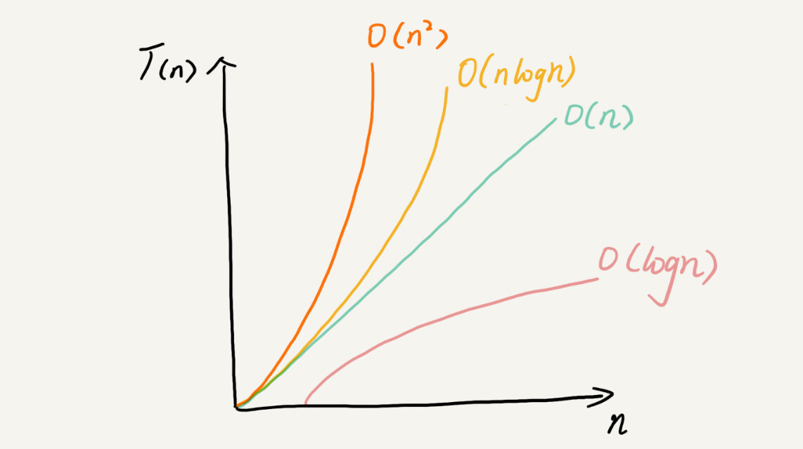

# C++ 基础 

https://www.runoob.com/cplusplus/cpp-tutorial.html

## 历史 
- C++ 由 Bjarne Stroustrup 于 1979 年在贝尔实验室开始设计开发。 1983 年更名为 C++
- C++ 扩充和完善(?) C 语言
- C++ 是一种面向对象的程序设计语言。
- C++ 是 C 的一个超集，事实上，任何合法的 C 程序都是合法的 C++ 程序。

## 标准库
标准的 C++ 由三个重要部分组成：
- 核心语言，提供了所有构件块，包括变量、数据类型和常量，等等。
- C++ 标准库，提供了大量的函数，用于操作文件、字符串等。
- 标准模板库（STL），提供了大量的方法，用于操作数据结构等。
## 编译器：g++ vs. gcc
- g++ 是将 gcc 默认语言设为 C++ 的一个特殊的版本，
   - 链接时它自动使用 C++ 标准库而不用 C 标准库。
     通过遵循源码的命名规范并指定对应库的名字
- gcc 来编译链接 C++ 程序也是可以的，但要明确指定使用 C++ 标准库。
```
$ gcc main.cpp -lstdc++ -o main
```

## 存储类 

存储类定义 C++ 程序中变量/函数的范围（可见性）和生命周期。放置在它们**所修饰的类型之前**。

C++ 程序中可用的存储类：
- auto (根据初始化表达式自动推断该变量的类型)
- register (定义 'register' 并不意味着变量将被存储在寄存器中，它意味着变量可能存储在寄存器中)
- static (编译器在程序的生命周期内保持局部变量的存在)
- extern (extern 用来在另一个文件中声明一个全局变量或函数)
- mutable (允许对象的成员替代常量)
- thread_local (C++11)
- 从 C++ 17 开始，auto 关键字不再是 C++ 存储类说明符，且 register 关键字被弃用。

## ? : 运算符
```cpp
Exp1 ? Exp2 : Exp3;
```

## 函数声明
- 函数声明中，参数的名称并不重要，只有参数的类型是必需的
## 函数参数
- 如果函数要使用参数，则必须声明接受参数值的变量。这些变量称为函数的形式参数
- 形式参数就像函数内的其他局部变量，在进入函数时被创建，退出函数时被销毁。
### 三种向函数传递参数的方式

- 传值调用 : 把参数的实际值赋值给函数的形式参数
- 指针调用 : 把参数的地址赋值给形式参数。 `void swap(int *x, int *y);`
  - 形参为指向实参地址的指针，当对形参的指向操作时，就相当于对实参本身进行的操作
- 引用调用 : 把参数的引用赋值给形式参数。 `void swap(int &x, int &y);`
  - 被调函数的形式参数作为局部变量在栈中开辟了内存空间，
  - 存放由主调函数放进来的实参变量的地址。
  - 被调函数对形参的任何操作都被处理成间接寻址，即通过栈中存放的地址访问主调函数中的实参变量。
- c语言只有pass-by-copy，即使对指针来说，也是pass-by-copy
  - 而c++扩展了一种pass-by-reference的参数传递。
  - c++的目的是对对象建立一个高层抽象，所以底层还是通过指针来实现pass-by-ref。
  - 所以使用ref的前提是你需要先有可ref的东西，即和对象的初始化绑定。
  - 而指针没有这个限制。
  
- 从底层汇编代码看，传引用就是通过传指针实现的。
  - 汇编代码都是通过
    - lea取地址
    - mov把取到的地址放到一块内存中。

#### ptr vs. ref
1. 初始化
- 引用被创建的同时必须被初始化 (因为必须确知数据类型，并分配空间)
- 指针则可以在任何时候被初始化
2. NULL
- 引用不能有NULL引用 引用必须与合法的存储单元关联 (因为要在栈上分配空间)
- 指针则可以是NULL

# 时间、空间复杂度分析

## 如何分析、统计算法的执行效率和资源消耗

### 为什么需要复杂度分析？

数据结构和算法解决的是“快”和“省”的问题，
- 如何让代码运行得更快，
- 如何让代码更省存储空间。 (内存还是存储？)

复杂度分析是整个算法学习的精髓

事后统计的问题：
- 测试结果依赖测试环境
- 测试结果依赖数据规模

**一个不依赖具体测试数据和测试环境，估计算法的执行效率的方法**

### 大O复杂度表示法

T(n) = O(f(n))

- n 表示数据规模的大小
- T(n) 表示代码执行的时间
- f(n) 表示每行代码执行的次数总和
- O，表示代码的执行时间 T(n) 与 f(n) 表达式成正比。
- 大O时间复杂度并不具体表示代码真正的执行时间
- 而是表示代码执行时间随数据规模增长的变化趋势
- 所以也叫作渐进时间复杂度（asymptotic time complexity），简称**时间复杂度**

### 时间复杂度分析

1. 只关注循环执行次数最多的一段代码
2. 加法法则：总复杂度等于量级最大的那段代码的复杂度
3. 乘法法则：嵌套代码的复杂度等于嵌套内外代码复杂度的乘积
  

### 几种常见时间复杂度实例分析

- 非多项式量级。
  - 非多项式量级只有两个：O(2n) 和 O(n!)。
  - 我们把时间复杂度为非多项式量级的算法问题叫作 NP问题。
     - （Non-Deterministic Polynomial，非确定多项式）
- 多项式量级
  - O(1)
     - 一般情况下，只要算法中不存在循环语句、递归语句，即使有成千上万行的代码，其时间复杂度也是Ο(1)。
  - O(logn)、O(nlogn)
     - 对数阶时间复杂度非常常见，同时也最难分析
      ```c
        i=1; while (i <= n) { i = i * 2; }
      ```  
      - 观察可知，i=1,2,4,8,2^4,2^5,2^6,.....,2^x
        - 即 2^x = n 时执行完毕，即x即为执行次数，所以x = log2(n)
        - 而对数的底可以忽略，统一表示为 O(logn)
     - 归并排序、快速排序的时间复杂度都是 O(nlogn)。
 - O(m+n)、O(m*n) 
  - 代码的复杂度由两个数据的规模来决定
### 空间复杂度分析

渐进空间复杂度（asymptotic space complexity），表示算法的存储空间与数据规模之间的增长关系。


### 最好、最坏、平均、均摊时间复杂度 

- 最好情况时间复杂度（best case time complexity）
  - 要查找的变量 x 正好是数组的第一个元素 -> O(1)
- 最坏情况时间复杂度（worst case time complexity）
  - 例如果数组查找变量x，需要把整个数组遍历 -> O(n)
- 平均情况时间复杂度（average case time complexity）
  - 变量x在数组中的位置有 n+1 种情况：
     - 在数组的 0～n-1 位置中和不在数组中。
     - 把每种情况下，查找需要遍历的元素个数累加起来，然后再除以 n+1
  - 遍历元素个数的平均值即： (1+2+3...+n+n)/(n+1) = (n*(n+3)) / (2*(n+1))
     - 还是O(n)
  - n+1 种情况，出现的概率并不是一样的，上述计算不够精确
    - 查找的数据出现在 0～n-1 中任意位置的概率就是 1/(2n)
    - 1 * 1/(2n) + 2* 1/(2n) + 3* 1/(2n) + ... n*1/(2n) + n*1/2 = (3n+1)/4
    -  还是O(n)
    - 是概率论中的加权平均值，也叫作期望值
  - 平均时间复杂度的全称应该叫**加权平均时间复杂度**或者**期望时间复杂度**。
- 均摊时间复杂度（amortized time complexity）
  - 均摊时间复杂度就是一种特殊的平均时间复杂度
  - 没必要花太多精力去区分它们。
  - 最应该掌握的是它的分析方法，摊还分析。
    - 每一次 O(n) 的插入操作，都会跟着 n-1 次 O(1) 的插入操作，
    - 所以把耗时多的那次操作均摊到接下来的 n-1 次耗时少的操作上，
    - 均摊下来，这一组连续的操作的均摊时间复杂度就是 O(1)。

### 小结


- 越高阶复杂度的算法，执行效率越低。
- O(1)、O(logn)、O(n)、O(nlogn)、O(n2 )
